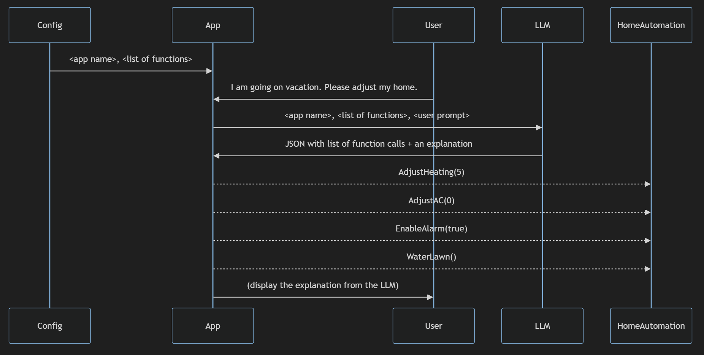

# gpt-function-calling-bare-bones README

Function Calling an LLM taking a bare-bones (no libraries) approach.

Larger LLMs can be used via Function Calling via a bare bones approach without any extra Python libraries.

This repo shows a simple example of an LLM driving a home automation system, by generating a list of function calls selected from the available functions.

The LLM is Anthropic Claude hosted on AWS Bedrock - but any large LLM should work.

The functions are listed in a JSON file. Here is a diagram to show how this approach can be used to control a Home Automation system via natural language:



## Set up

```shell
python -m pip install pipenv
python -m pipenv install
```

## Usage

```shell
python -m pipenv run python main.py <path to functions JSON file> <user prompt> [--chat]
```

### Example - LLM controlling a Home Automation system, asked to adjust for going on vacation:

```shell
python -m pipenv run python ./main.py ./data/home-automation-functions.json "I am going on vacation - please adjust my home"
```

Output:

```
[
    {
        "functionCalls": [
            {
                "name": "AdjustAC",
                "parameters": [
                    {"name": "level", "value": 0}
                ]
            },
            {
                "name": "AdjustHeating",
                "parameters": [
                    {"name": "level", "value": 5}
                ]
            },
            {
                "name": "AdjustLighting",
                "parameters": [
                    {"name": "level", "value": 1}
                ]
            },
            {
                "name": "EnableAlarm",
                "parameters": [
                    {"name": "enabled", "value": true}
                ]
            },
            {
                "name": "ReadInternalThermostatFahrenheit",
                "parameters": []
            },
            {
                "name": "ReadExternalThermostatFahrenheit",
                "parameters": []
            },
            {
                "name": "WaterLawn",
                "parameters": []
            }
        ],
        "explanation": "While on vacation, the AC and lighting should be minimized to save energy, the heating set to a moderate level to avoid freezing, and the alarm enabled for security. The lawn should be watered and internal/external temperatures monitored."
    }
]
```

### Example - chat mode

```shell
python -m pipenv run python ./main.py ./data/home-automation-functions.json "I am going on vacation - please adjust my home" --chat
```

```
How can I help? >>turn off the heat
>> USER: turn off the heat
=== === ===     [3] PROMPT      === === ===
=== === ===     [4] RESPONSE    === === ===
'''json
[
  {
    "name": "AdjustHeating",
    "parameters": [
      {"name": "level", "value": 0}
    ]
  }
]
'''

To turn off the heating, I called the AdjustHeating function and set the level parameter to 0. This will adjust the heating to the minimum level to turn it off.

How can I help? >>check if lawn is ok

> > USER: check if lawn is ok
> > === === === [5] PROMPT === === ===
> > === === === [6] RESPONSE === === ===

'''json
[
  {
    "name": "CheckIfRainIsDue",
    "parameters": []
  },
  {
    "name": "WaterLawn",
    "parameters": []
  }
]
'''

To check if the lawn is okay, I included:

1. CheckIfRainIsDue - to see if rain is expected which would water the lawn naturally
2. WaterLawn - to water the lawn if needed

I omitted any parameters as those functions do not take any based on the provided function definitions.

USER >>check if lawn is ok

POST PROC >>
[
{
"name": "CheckIfRainIsDue",
"parameters": []
},
{
"name": "WaterLawn",
"parameters": []
}
]

```

## Testing

```shell
./test.sh
````
