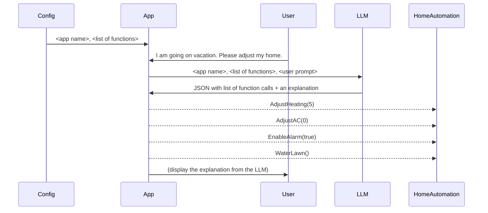

```mermaid

sequenceDiagram
    Config ->> App: <app name>, <list of functions>
    User ->> App: I am going on vacation. Please adjust my home.
    App ->> LLM: <app name>, <list of functions>, <user prompt>
    LLM ->> App: JSON with list of function calls + an explanation
    App -->> HomeAutomation: AdjustHeating(5)
    App -->> HomeAutomation: AdjustAC(0)
    App -->> HomeAutomation: EnableAlarm(true)
    App -->> HomeAutomation: WaterLawn()
    App ->> User: (display the explanation from the LLM)
```
